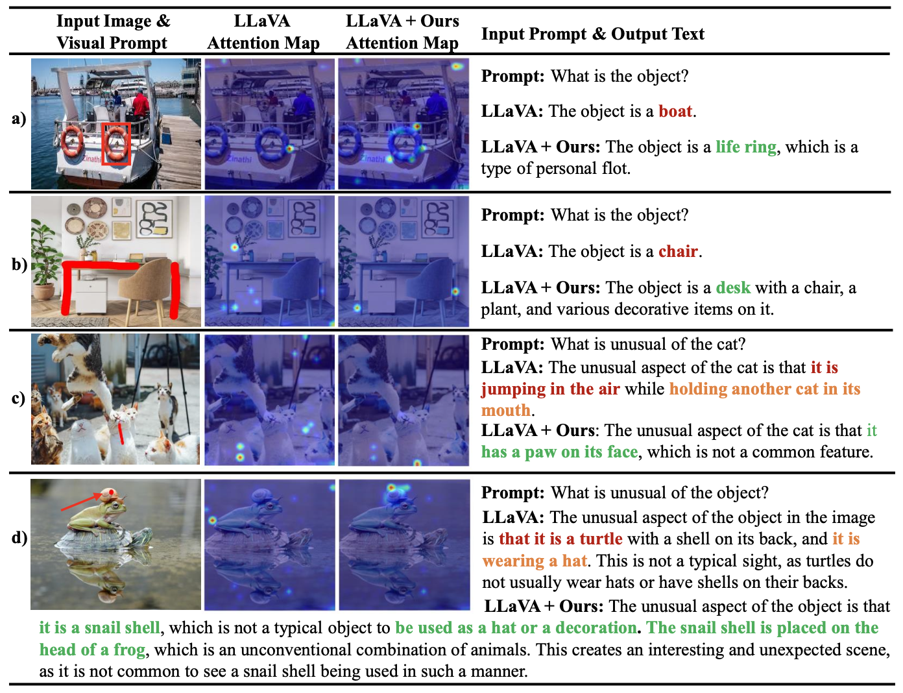

# ControlMLLM

The repo is for the paper [ControlMLLM: Training-Free Visual Prompt Learning for Multimodal Large Language Models](https://arxiv.org/abs/2407.21534).

```
@misc{wu2024controlmllmtrainingfreevisualprompt,
      title={ControlMLLM: Training-Free Visual Prompt Learning for Multimodal Large Language Models}, 
      author={Mingrui Wu and Xinyue Cai and Jiayi Ji and Jiale Li and Oucheng Huang and Gen Luo and Hao Fei and Xiaoshuai Sun and Rongrong Ji},
      year={2024},
      eprint={2407.21534},
      archivePrefix={arXiv},
      primaryClass={cs.CV},
      url={https://arxiv.org/abs/2407.21534}, 
}
```
## Features
 - Training-free method, supports running on a single RTX 3090 24GB GPU.
 - Provides visualization tools in ```utils.py``` for interpretability.

## News
 - ```2024/8/8:``` We release demo on InstructBLIP.
 - ```2024/8/2:``` We release demo on LLaVA v1.5.

## Setup
```
conda create -n controlmllm python=3.9
conda activate controlmllm
pip install -r requirements.txt
```

Install the Visulizer,
```
git clone https://github.com/luo3300612/Visualizer
cd Visualizer
pip install -e .
```
Install the Transformers we preprocessed,
```
git clone https://github.com/mrwu-mac/transformers
cd transformers
pip install -e .
```
Tips: Our key modification in the Transformers involves using the Visualizer toolkit to obtain gradient-based attention maps. If you need to modify your own model, you can easily do so by using the Visualizer to decorate the attention function in your LLM decoder,
```
from visualizer import get_local
class LLMAttention():
    @get_local('attn_weights')
    def forward():
         ...
        attn_weights, value = scaled_dot_product_attention(
            query,
            key,
            value
        )
        attn_output = attn_weights @ value
         ...
        return attn_output
```
And obtain gradients by removing the @torch.no_grad() decorator during generation,
```
class LLMGeneration():
    # @torch.no_grad()
    def generate():
```
## Support Models
 - [LLaVA v1.5](https://huggingface.co/llava-hf/llava-1.5-7b-hf)
 - [InstructBLIP](https://huggingface.co/Salesforce/instructblip-vicuna-7b)
 - More
   
## Demo
```
python llava_demo.py
```


Tips: Due to the image cropping during preprocessing in LLaVA1.5, referring to region at the edges of the image may become unreliable. If your referring does not work, you can also try slightly adjusting the visual prompt or text prompt, which might produce surprising results.


## ROC and RTC task 
Download [data](https://drive.google.com/drive/folders/1k45OVgWmt3Y04hPJe7rSWXGVZq98YLS4?usp=sharing) and format the data as,
```
- data
      - ROC
           - question_roc.json
           - LVIS
               - image
               - mask
      - RTC
           - question_rtc.json
           - COCO-Text
               - image
               - mask
```

We will upload the code in a few days once it's ready.

## Results


## Acknowledge
[Layout-Guidance](https://github.com/silent-chen/layout-guidance), [Transformers](https://github.com/huggingface/transformers) and [Visualizer](https://github.com/luo3300612/Visualizer).
